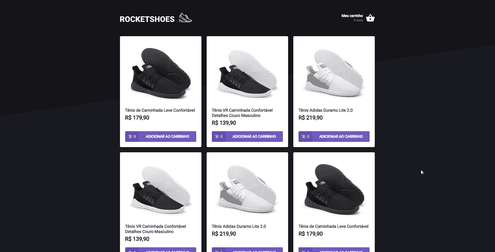

<p align="center">

</p>

<p align="center">🛒 An simple ecommerce application</p>

Tabela de conteúdos
=================
<p align="center">
  <a href="#about">About</a> •
  <a href="#tecnologies">Tecnologies</a> •
  <a href="#pre-requirements">Pre-requirements</a> •
  <a href="#running-the-project">Running the project</a> •
  <a href="#contributors">Contributors</a> •
  <a href="#author">Author</a>
</p>

-------


<h3 align="center">🚧 Some adjustments to do 🚧</h3>

## **About**
</img>

The intent of this project is only practicing some concepts of React and its context API hooks

## Tecnologies

The following technologies were used:

- [React](https://pt-br.reactjs.org/)
- [styled-components](https://styled-components.com/)
- [json-server](https://www.npmjs.com/package/json-server)
- [TypeScript](https://www.typescriptlang.org/)

## **Pre-requirements**

First of all you will need these tools:
[Git](https://git-scm.com), [Node.js](https://nodejs.org/en/), [Yarn](https://yarnpkg.com/)

## **Running the project**

The project have a simulation of backend, so you will need to execute in 2 terminals

```bash
# Clone this repo
git clone <https://github.com/GbCarvalho/rocket-shoes>

# Access the folder of the cloned repo
cd rocket-shoes

# Install all dependencies
yarn

# Execute the application in the dev mode
yarn server

# The server will be initialized at the port 3333 - access <http://localhost:3333> for a preview
```

Also execute:

```bash
yarn start
```


## **Contributors**

This is an sample project but every contribution is welcome!

## **Author**

Made with ❤ by Gabriel Carvalho, Get in contact!

[](https://www.linkedin.com/in/gcb/) 
[](mailto:braga.gabrielcarvalho@gmail.com)
[](https://app.rocketseat.com.br/me/gc)
